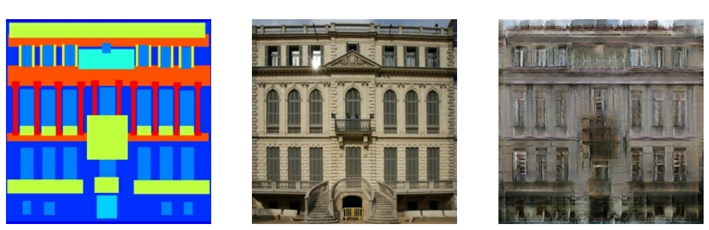
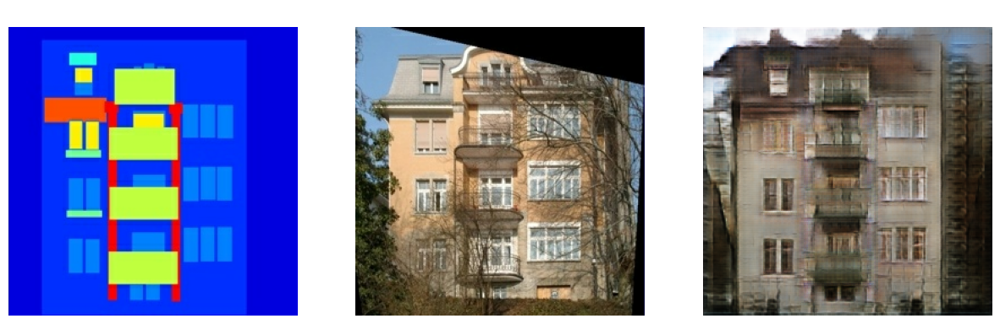

# Pix2Pix Generative Adversarial Network (GAN)

**Pix2Pix GAN** is a deep learning project that focuses on image-to-image translation tasks. This repository contains the code and resources for training and using a Pix2Pix model to convert images from one domain to another.

## Overview

The Pix2Pix GAN model is a powerful architecture for various image translation tasks. It learns to map input images from one domain to output images in another domain. The model achieves this translation by training on a dataset containing paired images from both domains.

## Results

Here are some sample results obtained using our trained Pix2Pix GAN model:

*Input Image -> Label Image -> Generated Image*
 
*Input Image -> Label Image -> Generated Image*

## Training
 - Clone repo 
 - install requirements - pip -r install requirements.txt
 - run python main.py
 - or pull directly from docker : docker pull tornikeam/pix2pix_gan:latest

## Acknowledgments

- This project is inspired by the Pix2Pix GAN paper by [Isola et al.](https://arxiv.org/abs/1611.07004).
